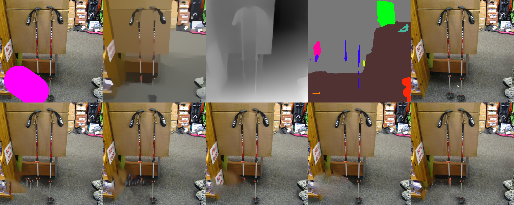

0.050, 0.054, 0.055, 0.055, 0.047

0.017, 0.016, 0.020, 0.020, 0.010

0.067, 0.063, 0.070, 0.070, 0.059

0.030, 0.028, 0.035, 0.035, 0.026

0.041, 0.048, 0.036, 0.036, 0.045

0.038, 0.038, 0.051, 0.051, 0.028

0.057, 0.062, 0.065, 0.065, 0.047

0.041, 0.043, 0.033, 0.033, 0.036

0.054, 0.050, 0.060, 0.060, 0.043

0.049, 0.045, 0.043, 0.043, 0.044

0.048, 0.048, 0.036, 0.036, 0.035

0.026, 0.039, 0.028, 0.028, 0.028

0.047, 0.043, 0.043, 0.043, 0.043

0.018, 0.036, 0.046, 0.046, 0.032

